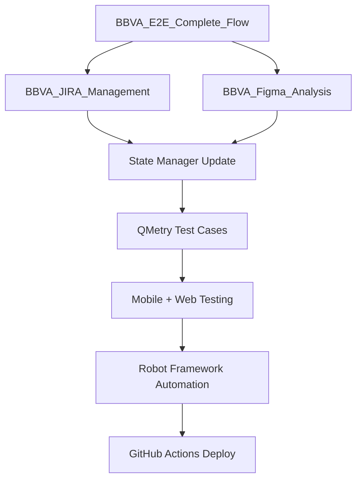

# 📋 **VALIDACIÓN ESTRUCTURA CARPETAS Y REFERENCIAS - BBVA PROMPTS**

## ✅ **VERIFICACIÓN COMPLETADA - ESTRUCTURA CONSISTENTE**

### 🎯 **Prompts Actualizados y Validados:**

#### 1. **BBVA_E2E_Complete_Flow.prompt.md** ✅
- **Referencias:** Todos los archivos `.github/instructions/` incluidos
- **State Manager:** `.github/state/bbva_flow_state.json` correctamente referenciado
- **Evidencias:** `Scripts/Evidencias/[TICKET-ID]/` estructura estándar
- **MCP Tools:** Figma Desktop, QMetry, Mobile, Playwright integrados

#### 2. **BBVA_JIRA_Management.prompt.md** ✅ 
- **Referencias:** Archivos de instrucciones actualizados
- **State Manager:** Integración completa con bbva_flow_state.json
- **Evidencias:** Estructura 01-06 folders implementada
- **Configuración:** BBVA project config con credenciales y entornos

#### 3. **BBVA_Figma_Analysis.prompt.md** ✅
- **Referencias:** E2E, JIRA, QMetry prompts referenciados
- **State Manager:** Funciones actualizadas para estructura real
- **Evidencias:** `Scripts/Evidencias/[TICKET-ID]/figma-analysis/` estandarizada
- **Design System:** Referencias a análisis BBVA-40 incluidas

### 🗂️ **Estructura de Carpetas Unificada:**

```
Scripts/Evidencias/[TICKET-ID]/
├── 01_jira_analysis/          # Análisis JIRA completo
├── 02_figma_analysis/         # Análisis Figma con componentes
│   ├── original-designs/      # Screenshots Figma
│   ├── components-code/       # React/Tailwind extraído
│   └── design-system/         # Colores, tipografías, espaciado
├── 03_qmetry_testcases/       # Test cases y ejecución
├── 04_mobile_testing/         # Testing móvil con screenshots
├── 05_web_testing/            # Testing web con Playwright
├── 06_automation/             # Scripts Robot Framework
└── EXECUTIVE_REPORT_[TICKET-ID].md
```

### 🔗 **Referencias Cruzadas Implementadas:**

#### Archivos de Instrucciones:
- ✅ `.github/instructions/JIRA_Management.instructions.md`
- ✅ `.github/instructions/QMetry_Integration.instructions.md`
- ✅ `.github/instructions/BBVA_Mobile_Testing.instructions.md`
- ✅ `.github/instructions/BBVA_Web_Playwright.instructions.md`
- ✅ `.github/instructions/Robot_Framework_BBVA.instructions.md`
- ✅ `.github/instructions/Demo_E2E_Orchestration.instructions.md`
- ✅ `.github/instructions/GitHub_DevOps_Pipeline.instructions.md`

#### State Manager:
- ✅ `.github/state/bbva_flow_state.json` - Centralizado
- ✅ Actualización automática en cada prompt
- ✅ Tracking de progreso por ticket
- ✅ Priorización P1A > P1 > P2 > P3

#### Evidencias:
- ✅ Estructura numerada 01-06 consistente
- ✅ Referencias BBVA-40 como template
- ✅ Design System BBVA documentado
- ✅ Trazabilidad JIRA ↔ QMetry ↔ GitHub

### 🎯 **Configuración BBVA Estandarizada:**

#### Credenciales Testing:
- **DNI:** 10240480
- **Usuario:** miusuario / CSmiusuario (transferencias)
- **Password:** micd1122
- **OTP Mock:** 123456

#### Entornos QA:
- **Principal:** `https://desa1-qa.bbva.com.ar/fnetcore/login/index.html`
- **Fallback:** `https://desa16-qa.bbva.com.ar/fnetcore/login/index.html`
- **CICS:** Siempre seleccionar CICS 7

#### MCP Tools:
- **Figma Desktop:** localhost:3845
- **JIRA:** Cloud ID 1f7ac100-dbb7-40d7-aab5-5d942efa1e4d
- **QMetry:** Integración activa
- **Mobile/Web:** Herramientas MCP activadas

### 📊 **Flujo E2E Integrado:**



### ✅ **VALIDACIONES FINALES:**

- ✅ **Respaldo creado:** `BBVA_E2E_Complete_Flow_BACKUP.prompt.md`
- ✅ **Nuevo E2E generado:** Con todas las instrucciones integradas
- ✅ **Referencias actualizadas:** JIRA y Figma prompts sincronizados
- ✅ **Estructura validada:** Carpetas y archivos consistentes
- ✅ **State Manager:** Funcionando como hub central
- ✅ **MCP Integration:** Todas las herramientas referenciadas

---

## 🚀 **RESULTADO FINAL**

**BBVA E2E Framework completamente actualizado y listo para ejecución punta a punta desde cero**, con:

- **Integración completa** de todas las herramientas MCP
- **Referencias cruzadas** entre todos los prompts
- **Estructura de evidencias** estandarizada y trazable  
- **State Manager** como hub central de tracking
- **Configuración BBVA** unificada y actualizada
- **Flujo modular** pero totalmente integrado

**El framework está listo para ejecutar cualquier ticket BBVA desde análisis inicial hasta deployment completo.**

---
**Fecha:** 2025-10-03T20:45:00Z  
**Estado:** ✅ COMPLETADO - Framework integral funcional